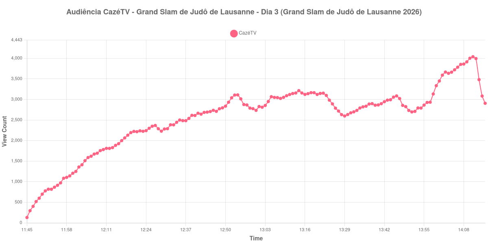

+++
date = 2026-08-31T01:51:00-03:00
draft = false
title = "Confira como foi a audiência de Grand Slam de Judô de Lausanne - Dia 3 na CazéTV - 30-08-2026"
author = 'Instituto Cambacica de Audiência'
summary = "Veja como foi a audiência de Grand Slam de Judô de Lausanne - Dia 3 na CazéTV"
tags = ['YouTube', 'Analytics', 'Audiência', 'CazeTV', 'Grand Slam de Judô de Lausanne - Dia 3', 'Grand Slam de Judô']
categories = ['Audiência']
canais = ['CazeTV']
campeonatos = ['Grand Slam de Judo 2026']
data_evento = 2026-08-30
+++

Neste texto, vamos informar os resultados da audiência em tempo real obtidos na CazéTV, durante a transmissão de Grand Slam de Judô de Lausanne - Dia 3, apresentada como parte de Grand Slam de Judô de Lausanne 2026, em 30/08/2026. Não foi possível confirmar a cronologia completa do evento em fontes independentes; por isso, adotamos o formato curto e não atribuímos à curva horários de jogo, placares ou outros fatos não demonstrados pelos dados.

A audiência começou a ser medida às 30/08/2026 11:45:55 (Horário de Brasília). Os dados abaixo partem do primeiro registro disponível e o recorte vai até o último dado coletado. Os principais pontos da audiência são (em aparelhos conectados):

* **Início da Medição (11:45:55): 130**
* **Final da Medição (14:15:55): 2.907**

O pico de audiência foi às 14:11:55, com **4.039** aparelhos conectados simultâneos.

Para Grand Slam de Judô de Lausanne - Dia 3 na CazéTV, o maior valor do período observado foi 4.039 aparelhos. A comparação segura é com os próprios limites da medição: 130 no início e 2.907 no encerramento.

Não encontramos cauda de VOD nesta medição. Os números representam o contador da transmissão ao vivo, não visualizações acumuladas do vídeo gravado.

No gráfico a seguir, mostramos a evolução da audiência entre o primeiro registro da medição e o último registro coletado, num total de 151 registros:

Para você verificar os metadados desta medição, você pode consultar o [repositório contendo o CSV com os dados e com os prints do minuto a minuto da medição](https://github.com/institutocambacica/audiencias_29_30_08_2026/tree/main/2026-08-30_judo_7eZUd1vPbK8).

---

*Para mais informações sobre nossa metodologia, visite nossa página [Sobre](/sobre).*
