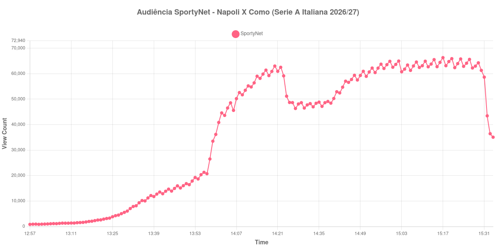

+++
date = 2026-08-31T01:57:00-03:00
draft = false
title = "Confira como foi a audiência de Napoli X Como na SportyNet - 30-08-2026"
author = 'Instituto Cambacica de Audiência'
summary = "Veja como foi a audiência de Napoli X Como na SportyNet"
tags = ['YouTube', 'Analytics', 'Audiência', 'SportyNet', 'Napoli', 'Como', 'Serie A Italiana']
categories = ['Audiência']
canais = ['SportyNet']
campeonatos = ['Serie A Italiana 2026']
data_evento = 2026-08-30
+++

Neste texto, vamos informar os resultados da audiência em tempo real obtidos na SportyNet, durante a transmissão de Napoli X Como, apresentada como parte de Serie A Italiana 2026/27, em 30/08/2026. Não foi possível confirmar a cronologia completa do evento em fontes independentes; por isso, adotamos o formato curto e não atribuímos à curva horários de jogo, placares ou outros fatos não demonstrados pelos dados.

A audiência começou a ser medida às 30/08/2026 12:57:55 (Horário de Brasília). Os dados abaixo partem do primeiro registro disponível e o recorte vai até o último dado coletado. Os principais pontos da audiência são (em aparelhos conectados):

* **Início da Medição (12:57:55): 837**
* **Final da Medição (15:34:55): 35.066**

O pico de audiência foi às 15:17:55, com **66.309** aparelhos conectados simultâneos.

Na curva de Napoli X Como na SportyNet, a coleta partiu de 837 aparelhos conectados e alcançou o máximo de 66.309. O último registro válido marcou 35.066 aparelhos.

Não encontramos cauda de VOD nesta medição. Os números representam o contador da transmissão ao vivo, não visualizações acumuladas do vídeo gravado.

No gráfico a seguir, mostramos a evolução da audiência entre o primeiro registro da medição e o último registro coletado, num total de 158 registros:

Para você verificar os metadados desta medição, você pode consultar o [repositório contendo o CSV com os dados e com os prints do minuto a minuto da medição](https://github.com/institutocambacica/audiencias_29_30_08_2026/tree/main/2026-08-30_napoli-x-como_dlkeVCioLEs).

---

*Para mais informações sobre nossa metodologia, visite nossa página [Sobre](/sobre).*
