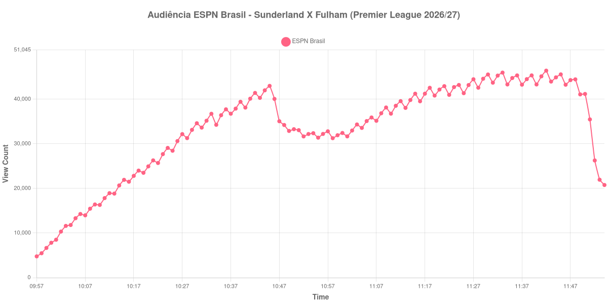

+++
date = 2026-08-31T01:43:00-03:00
draft = false
title = "Confira como foi a audiência de Sunderland X Fulham na ESPN Brasil - 30-08-2026"
author = 'Instituto Cambacica de Audiência'
summary = "Veja como foi a audiência de Sunderland X Fulham na ESPN Brasil"
tags = ['YouTube', 'Analytics', 'Audiência', 'ESPN Brasil', 'Sunderland', 'Fulham', 'Premier League']
categories = ['Audiência']
canais = ['ESPN Brasil']
campeonatos = ['Premier League 2026']
data_evento = 2026-08-30
+++

Neste texto, vamos informar os resultados da audiência em tempo real obtidos na ESPN Brasil, durante a transmissão de Sunderland X Fulham, apresentada como parte de Premier League 2026/27, em 30/08/2026. Não foi possível confirmar a cronologia completa do evento em fontes independentes; por isso, adotamos o formato curto e não atribuímos à curva horários de jogo, placares ou outros fatos não demonstrados pelos dados.

A audiência começou a ser medida às 30/08/2026 09:57:55 (Horário de Brasília). Os dados abaixo partem do primeiro registro disponível e o recorte vai até o último dado coletado. Os principais pontos da audiência são (em aparelhos conectados):

* **Início da Medição (09:57:55): 4.771**
* **Final da Medição (11:54:55): 20.771**

O pico de audiência foi às 11:42:55, com **46.404** aparelhos conectados simultâneos.

Para Sunderland X Fulham na ESPN Brasil, o maior valor do período observado foi 46.404 aparelhos. A comparação segura é com os próprios limites da medição: 4.771 no início e 20.771 no encerramento.

Não encontramos cauda de VOD nesta medição. Os números representam o contador da transmissão ao vivo, não visualizações acumuladas do vídeo gravado.

No gráfico a seguir, mostramos a evolução da audiência entre o primeiro registro da medição e o último registro coletado, num total de 118 registros:

Para você verificar os metadados desta medição, você pode consultar o [repositório contendo o CSV com os dados e com os prints do minuto a minuto da medição](https://github.com/institutocambacica/audiencias_29_30_08_2026/tree/main/2026-08-30_sunderland-x-fulham_GWfMxuxuKp4).

---

*Para mais informações sobre nossa metodologia, visite nossa página [Sobre](/sobre).*
