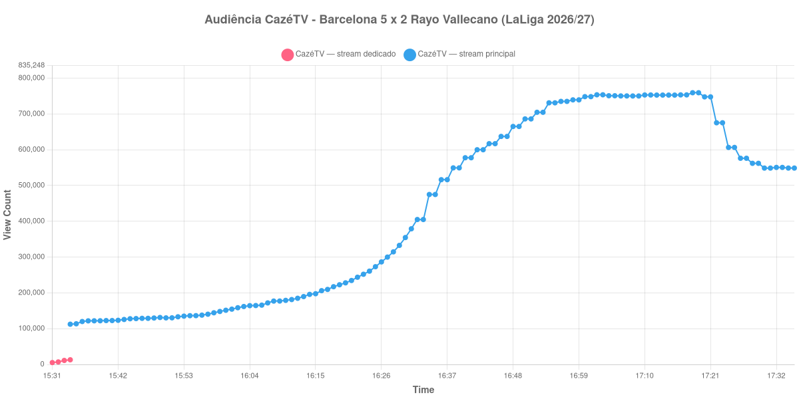

+++
date = 2026-09-03T21:06:00-03:00
draft = false
title = "Confira como foi a audiência de Barcelona X Rayo Vallecano na CazéTV - 31-08-2026"
author = 'Instituto Cambacica de Audiência'
summary = "Veja a medição que a CazéTV começou em dois streams e que uma queda de energia interrompeu no intervalo"
tags = ['YouTube', 'Analytics', 'Audiência', 'CazeTV', 'Barcelona', 'Rayo Vallecano', 'LaLiga']
categories = ['Audiência']
canais = ['CazeTV']
campeonatos = ['LaLiga 2026']
data_evento = 2026-08-31
+++

Neste texto, vamos informar os resultados da audiência em tempo real obtidos na CazéTV, durante a transmissão de Barcelona X Rayo Vallecano, jogo da 3ª rodada da LaLiga de 2026/27, no Spotify Camp Nou, em Barcelona, em 31/08/2026, diante de 57.768 pessoas. O Barcelona venceu por 5 a 2, com dois gols de Raphinha, dois de Lamine Yamal, um gol contra de Florian Lejeune e dois de Sergio Camello para o Rayo Vallecano. Ao intervalo, momento até onde a nossa medição alcança, o placar era Barcelona 2 a 1.

Esta medição tem duas particularidades e as duas precisam ser ditas antes dos números. A primeira: a CazéTV abriu um stream dedicado a esta partida, encerrou-o pouco depois e migrou a transmissão para o vídeo em que exibira Lecce X Roma, cuja transmissão foi retitulada no ar. Por isso a lista abaixo tem duas séries que não se somam — no mesmo minuto, o stream dedicado marcava 12.981 aparelhos e o principal, 112.369. A segunda: a medição foi interrompida por uma queda de energia às 17:35:55, o que significa que ela cobre apenas os primeiros minutos do segundo tempo e nenhum dos quatro gols marcados depois do intervalo.

A audiência começou a ser medida às 31/08/2026 15:31:55 (Horário de Brasília). Os dados abaixo partem do primeiro registro disponível e o recorte vai até o último dado coletado. Os principais pontos da audiência são (em aparelhos conectados):

* **Início da medição no stream dedicado (15:31:55): 5.165**
* **Último registro do stream dedicado (15:34:55): 12.981**
* **Início da medição no stream principal (15:34:55): 112.369**
* **Início da partida (16:30:55): 354.602**
* Após o gol de Sergio Camello, do Rayo Vallecano, aos 12 minutos do primeiro tempo (16:42:55): 600.016
* Após o gol de Raphinha, do Barcelona, aos 19 minutos do primeiro tempo (16:49:55): 665.063
* Após o gol de Lamine Yamal, do Barcelona, aos 21 minutos do primeiro tempo (16:51:55): 686.157
* **Fim do primeiro tempo (17:18:55): 759.316**
* Durante o intervalo (17:30:55): 548.746
* **Início do segundo tempo (17:33:55): 550.600**
* **Final da Medição (17:35:55): 548.788**

O pico de audiência foi às 17:18:55, no apito que encerrou o primeiro tempo, com **759.316** aparelhos conectados simultâneos.

A herança do jogo anterior explica o formato do começo da curva. O stream principal não parte do zero: quando recebeu o título de Barcelona X Rayo Vallecano, às 15:34:55, ele ainda carregava os 112.369 aparelhos que assistiam ao fim de Lecce X Roma — um minuto antes, sob o título antigo, o mesmo contador marcava 124.823. Esse patamar herdado se manteve quase intacto por quase uma hora, e só começou a subir de verdade perto do apito inicial: às 16:32:55, dois minutos depois de a bola rolar, já eram 404.982 aparelhos. A partir dali a curva sobe sem interrupção até o intervalo, e os três gols do primeiro tempo aparecem na lista em degraus sucessivos, de 600.016 para 665.063 e depois 686.157.

O intervalo tirou 28% do público, dos 759.316 do fim do primeiro tempo para os 548.746 do registro do intervalo, e a curva já havia voltado a subir quando a medição parou: os 550.600 do recomeço são maiores que o fundo do vale. Não sabemos o que veio depois, e é importante não fingir que sabemos — a queda de energia encerrou a coleta três minutos após o segundo tempo começar. O que os dados sustentam é que, até ali, os 759.316 do pico ficaram 114% acima dos 354.602 registrados no apito inicial, e que esta é a 3ª maior audiência das onze medições deste lote, a 5ª entre as 28 que temos da LaLiga e a 16ª entre as 75 da CazéTV — tudo isso sem contar um único minuto do segundo tempo em que o Barcelona fez mais três gols.

No gráfico a seguir, mostramos a evolução da audiência entre o primeiro registro da medição e o último registro coletado, num total de 125 registros. As duas séries aparecem separadas, e a do stream dedicado é praticamente indistinguível do eixo por causa da diferença de escala:

Para você verificar os metadados desta medição, você pode consultar os prints do minuto a minuto do [stream dedicado](https://github.com/institutocambacica/audiencias_31_08_03_09_2026/tree/main/2026-08-31_13-56-39/video_e1xt2UsGPuY) e do [stream principal](https://github.com/institutocambacica/audiencias_31_08_03_09_2026/tree/main/2026-08-31_13-56-39/video_Sw3CDgTlA5Y), além do [CSV com os dados da sessão](https://github.com/institutocambacica/audiencias_31_08_03_09_2026/blob/main/2026-08-31_13-56-39/results.csv), nas colunas `https://www.youtube.com/watch?v=e1xt2UsGPuY` e `https://www.youtube.com/watch?v=Sw3CDgTlA5Y`.

---

*Para mais informações sobre nossa metodologia, visite nossa página [Sobre](/sobre).*
