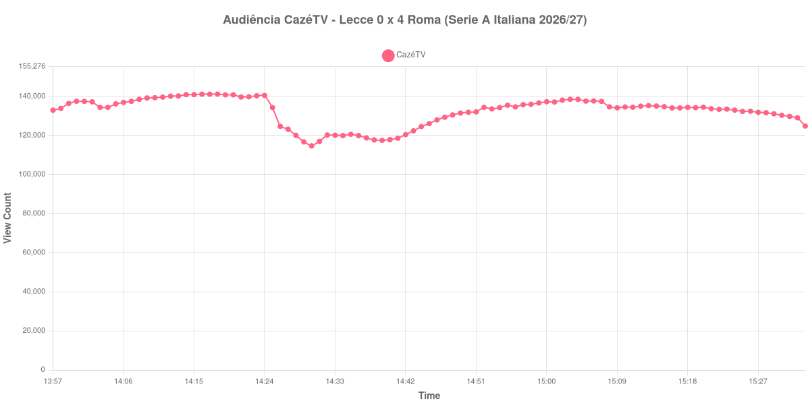

+++
date = 2026-09-03T21:00:00-03:00
draft = false
title = "Confira como foi a audiência de Lecce X Roma na CazéTV - 31-08-2026"
author = 'Instituto Cambacica de Audiência'
summary = "Veja a curva mais estável do lote: um 4 a 0 fora de casa que praticamente não mexeu na audiência da CazéTV"
tags = ['YouTube', 'Analytics', 'Audiência', 'CazeTV', 'Lecce', 'Roma', 'Serie A Italiana']
categories = ['Audiência']
canais = ['CazeTV']
campeonatos = ['Serie A Italiana 2026']
data_evento = 2026-08-31
+++

Neste texto, vamos informar os resultados da audiência em tempo real obtidos na CazéTV, durante a transmissão de Lecce X Roma, jogo da 2ª rodada da Serie A Italiana de 2026/27, no Stadio Via del Mare, em Lecce, em 31/08/2026. A Roma venceu por 4 a 0, com dois gols de Donyell Malen, um de Matías Soulé e um de Rodrigo Mora, e liquidou a partida antes da meia hora de jogo. O público presente não foi divulgado por nenhuma das fontes que consultamos.

A audiência começou a ser medida às 31/08/2026 13:57:55 (Horário de Brasília), com a partida já em andamento: a coleta entrou 27 minutos depois do apito inicial, e por isso os três gols do primeiro tempo ficaram fora do recorte. Na outra ponta, o recorte vai até o último dado coletado sob este título, porque a transmissão foi retitulada no ar e o mesmo vídeo passou a exibir outra partida. Os principais pontos da audiência são (em aparelhos conectados):

* **Início da Medição (13:57:55): 132.937**
* **Fim do primeiro tempo (14:18:55): 141.160**
* Durante o intervalo (14:30:55): 114.691
* **Início do segundo tempo (14:33:55): 120.119**
* Após o gol de Rodrigo Mora, da Roma, aos 65 minutos do segundo tempo (14:52:55): 134.394
* **Final da partida (15:22:55): 133.363**
* **Final da Medição (15:33:55): 124.823**

O pico de audiência foi às 14:18:55, no apito que encerrou o primeiro tempo, com **141.160** aparelhos conectados simultâneos.

O que esta curva tem de mais notável é justamente não ter acontecido quase nada nela. A medição inteira transcorre dentro de uma faixa estreita: o menor valor do recorte é o do registro do intervalo, 114.691, e o maior é o do apito que fecha o primeiro tempo, 141.160. Um 4 a 0 construído fora de casa e resolvido antes da meia hora costuma esvaziar transmissão; aqui não esvaziou. O intervalo levou 19% do público, dos 141.160 do fim do primeiro tempo para os 114.691 do registro do intervalo — a menor queda de intervalo das onze medições deste lote, cuja mediana foi de 32%.

O segundo tempo devolveu quase tudo o que o intervalo havia tirado: dos 120.119 do recomeço a audiência subiu 15% até os 138.512 do melhor minuto da etapa, às 15:03:55, e o gol de Rodrigo Mora aparece na lista com 134.394 aparelhos. Depois do apito final a transmissão não desabou: os 124.823 do último registro são 6% abaixo dos 133.363 marcados no encerramento da partida. A explicação para essa cauda tão firme está no próprio vídeo — em vez de encerrar, a CazéTV renomeou a transmissão e emendou Barcelona X Rayo Vallecano nela, e um minuto depois do nosso último registro o mesmo contador marcava 112.369 aparelhos, já sob o novo título. Entre as quatro medições que temos da Serie A Italiana, esta é a 2ª maior, atrás apenas de [Roma X Fiorentina](/posts/2026-08-24-roma-x-fiorentina-cazetv/), que chegou a 188.438; entre as 75 da CazéTV, é a 33ª.

No gráfico a seguir, mostramos a evolução da audiência entre o primeiro registro da medição e o último minuto em que o vídeo ainda exibia Lecce X Roma, num total de 97 registros:

Para você verificar os metadados desta medição, você pode consultar os [prints do minuto a minuto da transmissão](https://github.com/institutocambacica/audiencias_31_08_03_09_2026/tree/main/2026-08-31_13-56-39/video_Sw3CDgTlA5Y) — atenção: os prints posteriores ao nosso último registro já pertencem à outra partida — e o [CSV com os dados da sessão](https://github.com/institutocambacica/audiencias_31_08_03_09_2026/blob/main/2026-08-31_13-56-39/results.csv), na coluna `https://www.youtube.com/watch?v=Sw3CDgTlA5Y`.

---

*Para mais informações sobre nossa metodologia, visite nossa página [Sobre](/sobre).*
