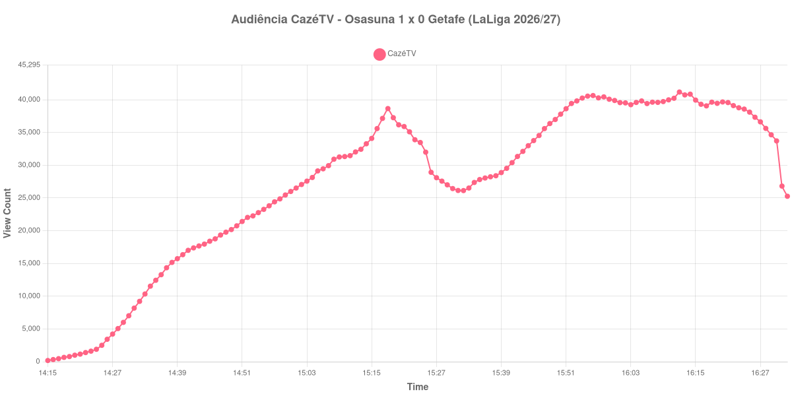

+++
date = 2026-09-03T21:03:00-03:00
draft = false
title = "Confira como foi a audiência de Osasuna X Getafe na CazéTV - 31-08-2026"
author = 'Instituto Cambacica de Audiência'
summary = "Veja como o pênalti dos acréscimos do primeiro tempo aparece na curva de audiência de Osasuna X Getafe na CazéTV"
tags = ['YouTube', 'Analytics', 'Audiência', 'CazeTV', 'Osasuna', 'Getafe', 'LaLiga']
categories = ['Audiência']
canais = ['CazeTV']
campeonatos = ['LaLiga 2026']
data_evento = 2026-08-31
+++

Neste texto, vamos informar os resultados da audiência em tempo real obtidos na CazéTV, durante a transmissão de Osasuna X Getafe, jogo da 3ª rodada da LaLiga de 2026/27, no estádio de El Sadar, em Pamplona, em 31/08/2026, diante de 19.672 pessoas. O Osasuna venceu por 1 a 0, com um gol de Ante Budimir de pênalti aos 45+2 minutos, marcado pelo árbitro Jon Ander González Esteban após revisão do VAR.

A audiência começou a ser medida às 31/08/2026 14:15:55 (Horário de Brasília). Como a coleta começou menos de duas horas antes do apito inicial, o gráfico e os números abaixo partem do primeiro registro disponível; a transmissão também encerrou antes de completar duas horas após o apito final, de modo que o recorte vai até o último dado coletado. Os principais pontos da audiência são (em aparelhos conectados):

* **Início da Medição (14:15:55): 180**
* **Início da partida (14:30:55): 7.013**
* Após o gol de Ante Budimir, do Osasuna, aos 45+2 minutos do primeiro tempo (15:17:55): 37.151
* **Fim do primeiro tempo (15:18:55): 38.653**
* Durante o intervalo (15:32:55): 26.130
* **Início do segundo tempo (15:33:55): 26.518**
* **Final da partida (16:22:55): 39.106**
* **Final da Medição (16:32:55): 25.262**

O pico de audiência foi às 16:12:55, já no segundo tempo, com **41.177** aparelhos conectados simultâneos.

O pênalti dos acréscimos deixou assinatura na curva. Nos dois minutos que antecedem o intervalo a audiência sobe, e o marco do gol, 37.151, é seguido imediatamente pelo maior valor de todo o primeiro tempo, os 38.653 do apito. Foi o único lance decisivo de uma etapa que as fontes descrevem sem nenhuma finalização no alvo até ali, e mesmo assim o público estava chegando: dos 7.013 do apito inicial aos 38.653 do intervalo, a transmissão multiplicou seu tamanho ao longo dos 48 minutos de primeiro tempo.

O intervalo custou 32% da audiência, dos 38.653 do fim do primeiro tempo para os 26.130 do registro do intervalo — exatamente a mediana das onze quedas de intervalo deste lote. O segundo tempo recuperou tudo e mais um pouco: dos 26.518 do recomeço até os 41.177 do pico, uma alta de 55%, e a curva sustentou esse patamar até o apito final, quando ainda marcava 39.106 aparelhos. O esvaziamento veio depois e foi abrupto: entre 16:30:55 e 16:31:55 o contador caiu de 33.714 para 26.814, e a medição encerrou dez minutos após o apito final, com os 25.262 do último registro ficando 35% abaixo dos 39.106 do encerramento da partida. Entre as 28 medições que temos da LaLiga, esta é a 26ª; entre as 75 da CazéTV, a 52ª — números modestos para uma transmissão que, ainda assim, cresceu do início ao fim da partida.

No gráfico a seguir, mostramos a evolução da audiência entre o primeiro registro da medição e o último registro coletado, num total de 138 registros:

Para você verificar os metadados desta medição, você pode consultar os [prints do minuto a minuto da transmissão](https://github.com/institutocambacica/audiencias_31_08_03_09_2026/tree/main/2026-08-31_13-56-39/video_-yxRpupWAgo) e o [CSV com os dados da sessão](https://github.com/institutocambacica/audiencias_31_08_03_09_2026/blob/main/2026-08-31_13-56-39/results.csv), na coluna `https://www.youtube.com/watch?v=-yxRpupWAgo`.

---

*Para mais informações sobre nossa metodologia, visite nossa página [Sobre](/sobre).*
