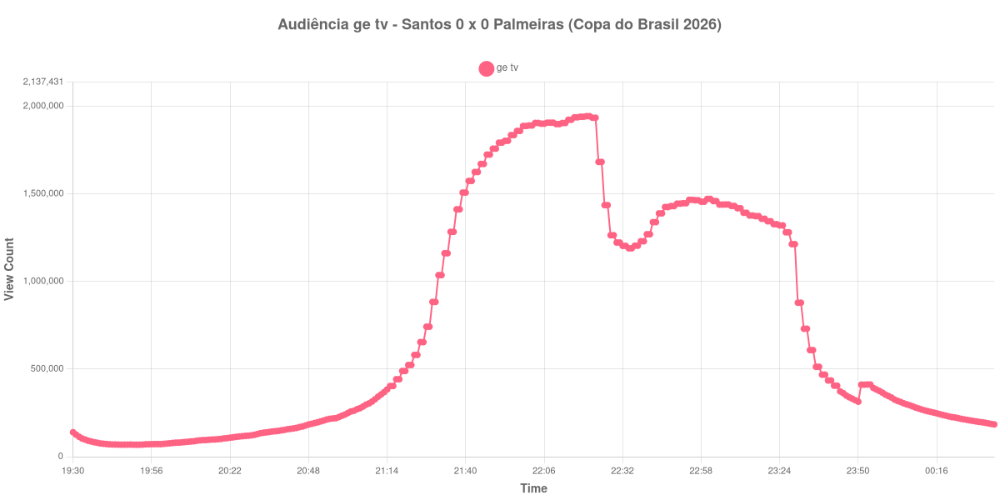

+++
date = 2026-09-03T21:09:00-03:00
draft = false
title = "Confira como foi a audiência de Santos X Palmeiras na ge tv - 02-09-2026"
author = 'Instituto Cambacica de Audiência'
summary = "Veja a maior audiência que já medimos na Copa do Brasil de 2026, num 0 a 0 que valeu vaga na semifinal"
tags = ['YouTube', 'Analytics', 'Audiência', 'GETV', 'Santos', 'Palmeiras', 'Copa do Brasil']
categories = ['Audiência']
canais = ['GETV']
campeonatos = ['Copa do Brasil 2026']
data_evento = 2026-09-02
+++

Neste texto, vamos informar os resultados da audiência em tempo real obtidos na ge tv, durante a transmissão de Santos X Palmeiras, jogo de volta das quartas de final da Copa do Brasil de 2026, na Vila Belmiro, em Santos, em 02/09/2026, diante de 15.077 pessoas. O jogo terminou em 0 a 0 e o Palmeiras avançou à semifinal pelo agregado, garantido pelos 3 a 0 do jogo de ida. Na reta final do primeiro tempo, Neymar sentiu a parte posterior da coxa direita, permaneceu em campo andando até o apito e foi substituído no intervalo.

A audiência começou a ser medida às 02/09/2026 19:11:55 (Horário de Brasília), mas o recorte abaixo parte de duas horas antes do apito inicial, como manda a nossa metodologia; na outra ponta, o recorte vai até o último dado coletado. Vale um aviso sobre o primeiro registro do recorte: ele cai exatamente sobre um degrau de troca de live. No minuto anterior o contador marcava 32.467 aparelhos, e a audiência que aparece na primeira linha da lista abaixo foi recuando nos minutos seguintes. Os principais pontos da audiência são (em aparelhos conectados):

* **Início do recorte (19:30:55): 139.267**
* **Início da partida (21:30:55): 883.098**
* **Fim do primeiro tempo (22:20:55): 1.943.119**
* Durante o intervalo (22:34:55): 1.189.208
* **Início do segundo tempo (22:35:55): 1.189.208**
* **Final da partida (23:22:55): 1.326.777**
* **Final da Medição (00:35:55): 184.148**

O pico de audiência foi às 22:20:55, no apito que encerrou o primeiro tempo, com **1.943.119** aparelhos conectados simultâneos.

É a maior audiência que já registramos para uma transmissão da Copa do Brasil: 1ª entre as oito medições que temos da competição, à frente do próprio jogo de ida deste confronto, [Palmeiras X Santos](/posts/2026-08-26-palmeiras-x-santos-getv/), cujo máximo foi de 1.533.115 aparelhos conectados. Também é a maior das onze medições deste lote e a 4ª entre as 26 que temos da ge tv, atrás de marcas como a de [Flamengo X Cruzeiro](/posts/2026-08-19-flamengo-x-cruzeiro-getv/), que chegou a 3.412.036. A escalada foi vertiginosa na última hora antes da bola rolar: dos 883.098 do apito inicial aos 1.943.119 do pico, uma alta de 120% em cinquenta minutos de jogo.

O intervalo é o momento mais duro da curva: 39% do público saiu, dos 1.943.119 do fim do primeiro tempo para os 1.189.208 do registro do intervalo. O segundo tempo devolveu parte disso — o melhor minuto da etapa, às 23:00:55, marcou 1.471.091 aparelhos, 24% acima dos 1.189.208 do recomeço —, mas nunca chegou perto de recuperar o patamar do primeiro tempo, o que é coerente com um jogo cuja definição já estava encaminhada. Depois do apito final a queda foi em degrau: entre 23:29:55 e 23:30:55 o contador despencou de 1.212.877 para 878.594, e os 184.148 do último registro são 86% abaixo dos 1.326.777 do encerramento da partida.

Há ainda um detalhe que só apareceu porque medimos as duas transmissões da noite. Às 23:51:55 a audiência desta live sobe de 313.894 para 410.903 aparelhos, uma reversão isolada no meio de uma queda contínua. O minuto anterior explica: a nossa medição de [Vitória X Vasco](/posts/2026-09-02-vitoria-x-vasco-getv/), na mesma ge tv, registrou seu último dado às 23:49:55, com 211.354 aparelhos. É uma troca de live, e o público que saiu de lá dá conta com folga do que entrou aqui.

No gráfico a seguir, mostramos a evolução da audiência entre duas horas antes do início da partida e o último registro coletado, num total de 306 registros:

Para você verificar os metadados desta medição, você pode consultar os [prints do minuto a minuto da transmissão](https://github.com/institutocambacica/audiencias_31_08_03_09_2026/tree/main/2026-09-02_19-11-12/video_fuEppG28-yk) e o [CSV com os dados da sessão](https://github.com/institutocambacica/audiencias_31_08_03_09_2026/blob/main/2026-09-02_19-11-12/results.csv), na coluna `https://www.youtube.com/watch?v=fuEppG28-yk`.

---

*Para mais informações sobre nossa metodologia, visite nossa página [Sobre](/sobre).*
