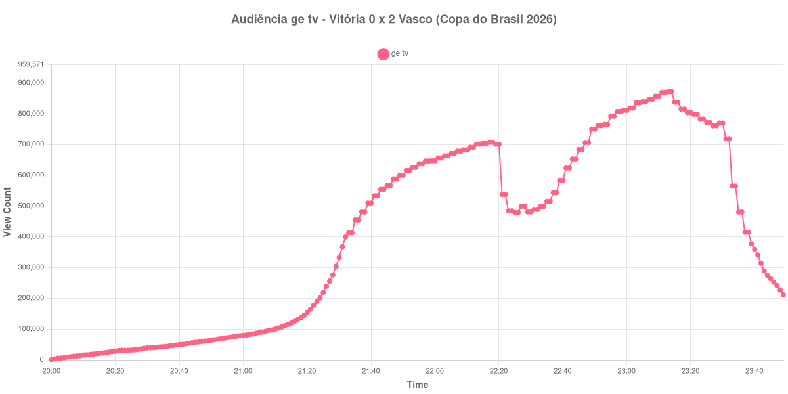

+++
date = 2026-09-03T21:12:00-03:00
draft = false
title = "Confira como foi a audiência de Vitória X Vasco na ge tv - 02-09-2026"
author = 'Instituto Cambacica de Audiência'
summary = "Veja como a audiência de Vitória X Vasco na ge tv reagiu aos dois gols que carimbaram a vaga cruz-maltina"
tags = ['YouTube', 'Analytics', 'Audiência', 'GETV', 'Vitória', 'Vasco', 'Copa do Brasil']
categories = ['Audiência']
canais = ['GETV']
campeonatos = ['Copa do Brasil 2026']
data_evento = 2026-09-02
+++

Neste texto, vamos informar os resultados da audiência em tempo real obtidos na ge tv, durante a transmissão de Vitória X Vasco, jogo de volta das quartas de final da Copa do Brasil de 2026, no Barradão, em Salvador, em 02/09/2026, diante de 28.499 pessoas. O Vasco venceu por 2 a 0, com gols de Andrés Gómez e de Puma Rodríguez, e avançou à semifinal pelo agregado. O Vitória ainda chegou a balançar a rede numa cobrança de falta, mas o impedimento semiautomático anulou o lance.

A audiência começou a ser medida às 02/09/2026 20:00:55 (Horário de Brasília). Como a coleta começou menos de duas horas antes do apito inicial, o gráfico e os números abaixo partem do primeiro registro disponível; a transmissão também encerrou antes de completar duas horas após o apito final, de modo que o recorte vai até o último dado coletado. Os principais pontos da audiência são (em aparelhos conectados):

* **Início da Medição (20:00:55): 745**
* **Início da partida (21:30:55): 332.399**
* **Fim do primeiro tempo (22:17:55): 707.545**
* Durante o intervalo (22:25:55): 479.071
* **Início do segundo tempo (22:32:55): 489.071**
* Após o gol de Andrés Gómez, do Vasco, aos 80 minutos do segundo tempo (23:07:55): 847.408
* Após o gol de Puma Rodríguez, do Vasco, aos 90+6 minutos do segundo tempo (23:23:55): 782.779
* **Final da partida (23:24:55): 782.779**
* **Final da Medição (23:49:55): 211.354**

O pico de audiência foi às 23:13:55, já no segundo tempo, com **872.337** aparelhos conectados simultâneos.

Esta é a curva mais bem comportada do lote, no sentido de que cada movimento tem uma causa identificável no jogo. O primeiro tempo é uma rampa contínua, dos 332.399 do apito inicial aos 707.545 do intervalo. O intervalo tira 32% do público, dos 707.545 do fim do primeiro tempo para os 479.071 do registro do intervalo. E o segundo tempo é onde tudo acontece: dos 489.071 do recomeço até os 872.337 do pico, a audiência sobe 78%, e o máximo cai seis minutos depois do gol de Andrés Gómez, que aparece na lista com 847.408 aparelhos.

O segundo gol chegou tarde demais para movimentar a curva. Puma Rodríguez marcou no último minuto dos acréscimos, e o marco correspondente, 782.779, é o mesmo valor do apito final — o contador do YouTube atualizava a cada dois minutos nesse trecho e não teve tempo de registrar reação nenhuma. O esvaziamento começou logo depois: entre 23:32:55 e 23:33:55 a audiência caiu de 719.176 para 565.325, e os 211.354 do último registro estão 73% abaixo dos 782.779 do encerramento da partida. Esse último número tem uma consequência fora deste post: um minuto depois de a nossa coleta terminar aqui, a medição de [Santos X Palmeiras](/posts/2026-09-02-santos-x-palmeiras-getv/), na mesma ge tv, saltou para 410.903 aparelhos. Foi para lá que boa parte deste público foi.

Entre as oito medições que temos da Copa do Brasil, esta é a 6ª; entre as 26 da ge tv, a 16ª; e é a 2ª maior das onze medições deste lote, atrás apenas da outra partida da mesma noite.

No gráfico a seguir, mostramos a evolução da audiência entre o primeiro registro da medição e o último registro coletado, num total de 230 registros:

Para você verificar os metadados desta medição, você pode consultar os [prints do minuto a minuto da transmissão](https://github.com/institutocambacica/audiencias_31_08_03_09_2026/tree/main/2026-09-02_19-11-12/video_IFaSjw1IFBY) e o [CSV com os dados da sessão](https://github.com/institutocambacica/audiencias_31_08_03_09_2026/blob/main/2026-09-02_19-11-12/results.csv), na coluna `https://www.youtube.com/watch?v=IFaSjw1IFBY`.

---

*Para mais informações sobre nossa metodologia, visite nossa página [Sobre](/sobre).*
