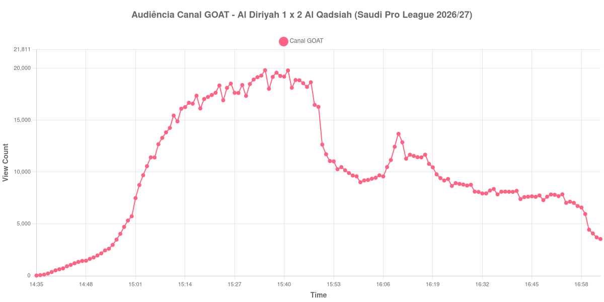

+++
date = 2026-09-03T21:21:00-03:00
draft = false
title = "Confira como foi a audiência de Al Diriyah X Al Qadsiah no Canal GOAT - 03-09-2026"
author = 'Instituto Cambacica de Audiência'
summary = "Veja o intervalo mais severo do lote, que levou quase metade do público de Al Diriyah X Al Qadsiah no Canal GOAT"
tags = ['YouTube', 'Analytics', 'Audiência', 'Canal-GOAT', 'Al Diriyah', 'Al Qadsiah', 'Saudi Pro League']
categories = ['Audiência']
canais = ['Canal GOAT']
campeonatos = ['Saudi Pro League 2026']
data_evento = 2026-09-03
+++

Neste texto, vamos informar os resultados da audiência em tempo real obtidos pelo Canal GOAT, durante a transmissão de Al Diriyah X Al Qadsiah, jogo da 5ª rodada da Saudi Pro League de 2026/27, em 03/09/2026. O Al Qadsiah venceu por 2 a 1, com um pênalti de Mateo Retegui e um gol de Julián Quiñones, e chegou a 12 pontos, invicto na competição; Óscar Rodríguez descontou para o Al Diriyah nos acréscimos. As fichas que consultamos divergem sobre o estádio da partida, e por isso preferimos não citá-lo; o público presente também não foi divulgado.

A audiência começou a ser medida às 03/09/2026 14:35:55 (Horário de Brasília). Como a coleta começou menos de duas horas antes do apito inicial, o gráfico e os números abaixo partem do primeiro registro disponível; a transmissão também encerrou antes de completar duas horas após o apito final, de modo que o recorte vai até o último dado coletado. Os principais pontos da audiência são (em aparelhos conectados):

* **Início da Medição (14:35:55): 30**
* **Início da partida (15:00:55): 5.742**
* **Fim do primeiro tempo (15:49:55): 16.294**
* Durante o intervalo (16:00:55): 9.026
* **Início do segundo tempo (16:04:55): 9.456**
* Após o gol de Mateo Retegui, do Al Qadsiah, aos 51 minutos do segundo tempo (16:08:55): 11.168
* Após o gol de Julián Quiñones, do Al Qadsiah, aos 58 minutos do segundo tempo (16:15:55): 11.445
* Após o gol de Óscar Rodríguez, do Al Diriyah, aos 90+6 minutos do segundo tempo (16:53:55): 7.860
* **Final da partida (16:54:55): 7.039**
* **Final da Medição (17:03:55): 3.548**

O pico de audiência foi às 15:35:55, ainda no primeiro tempo, com **19.828** aparelhos conectados simultâneos.

O intervalo desta partida foi o mais severo das onze medições deste lote: levou 45% do público, dos 16.294 do fim do primeiro tempo para os 9.026 do registro do intervalo, contra uma mediana de 32% no conjunto. O fundo do vale chegou onze minutos depois do apito, e a curva só voltou a subir com a bola rolando.

Vale reparar em onde o máximo aconteceu: às 15:35:55, com o jogo ainda 0 a 0 e faltando quatorze minutos para o intervalo. Os 19.828 do pico ficaram 245% acima dos 5.742 registrados no apito inicial, mas o segundo tempo nunca chegou perto disso — o melhor minuto da etapa, às 16:10:55, marcou 13.692 aparelhos, no rastro do pênalti de Retegui. Os dois gols do Al Qadsiah produziram os únicos movimentos de alta depois do intervalo, com 11.168 e 11.445 na lista, e dali em diante a curva desceu sem interrupção. O gol do Al Diriyah nos acréscimos aparece com 7.860 aparelhos, e a medição terminou nove minutos após o apito final, com os 3.548 do último registro ficando 50% abaixo dos 7.039 do encerramento da partida.

Entre as 19 medições que temos da Saudi Pro League, esta é a 7ª; entre as 33 do Canal GOAT, a 10ª; e é a 9ª das onze deste lote.

No gráfico a seguir, mostramos a evolução da audiência entre o primeiro registro da medição e o último registro coletado, num total de 149 registros:

Para você verificar os metadados desta medição, você pode consultar os [prints do minuto a minuto da transmissão](https://github.com/institutocambacica/audiencias_31_08_03_09_2026/tree/main/2026-09-03_06-53-52/video_pNIP3osPHKg) e o [CSV com os dados da sessão](https://github.com/institutocambacica/audiencias_31_08_03_09_2026/blob/main/2026-09-03_06-53-52/results.csv), na coluna `https://www.youtube.com/watch?v=pNIP3osPHKg`.

---

*Para mais informações sobre nossa metodologia, visite nossa página [Sobre](/sobre).*
