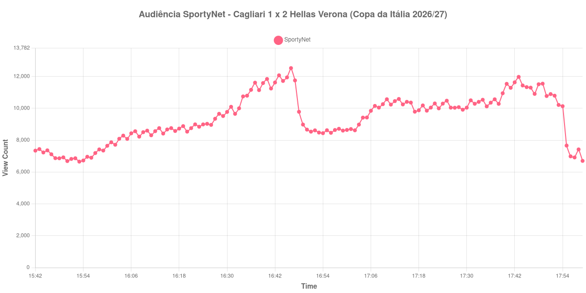

+++
date = 2026-09-03T21:30:00-03:00
draft = false
title = "Confira como foi a audiência de Cagliari X Hellas Verona na SportyNet - 03-09-2026"
author = 'Instituto Cambacica de Audiência'
summary = "Veja a única medição do lote que já começou com público formado, e o gol do fim que segurou a curva"
tags = ['YouTube', 'Analytics', 'Audiência', 'SportyNet', 'Cagliari', 'Hellas Verona', 'Copa da Italia']
categories = ['Audiência']
canais = ['SportyNet']
campeonatos = ['Copa da Italia 2026']
data_evento = 2026-09-03
+++

Neste texto, vamos informar os resultados da audiência em tempo real obtidos na SportyNet, durante a transmissão de Cagliari X Hellas Verona, jogo único da segunda rodada da Copa da Itália de 2026/27, na Unipol Domus, em Cagliari, em 03/09/2026. O Hellas Verona venceu por 2 a 1, com gols de Abdou Harroui e de Samuele Mulattieri, e eliminou o time da casa; Yerry Mendy havia empatado para o Cagliari. O público presente não foi divulgado por nenhuma das fontes que consultamos.

A audiência começou a ser medida às 03/09/2026 15:42:55 (Horário de Brasília). Como a coleta começou menos de duas horas antes do apito inicial, o gráfico e os números abaixo partem do primeiro registro disponível; a transmissão também encerrou antes de completar duas horas após o apito final, de modo que o recorte vai até o último dado coletado. Os principais pontos da audiência são (em aparelhos conectados):

* **Início da Medição (15:42:55): 7.346**
* **Início da partida (16:00:55): 7.650**
* Após o gol de Abdou Harroui, do Hellas Verona, aos 23 minutos do primeiro tempo (16:23:55): 8.848
* **Fim do primeiro tempo (16:46:55): 12.529**
* Durante o intervalo (16:54:55): 8.442
* **Início do segundo tempo (17:01:55): 8.701**
* Após o gol de Yerry Mendy, do Cagliari, aos 57 minutos do segundo tempo (17:14:55): 10.249
* Após o gol de Samuele Mulattieri, do Hellas Verona, aos 87 minutos do segundo tempo (17:44:55): 11.438
* **Final da partida (17:52:55): 10.797**
* **Final da Medição (17:59:55): 6.702**

O pico de audiência foi às 16:46:55, no apito que encerrou o primeiro tempo, com **12.529** aparelhos conectados simultâneos.

Esta é a única medição do lote que não começa perto do zero. O primeiro registro já marca 7.346 aparelhos, e o apito inicial pegou a transmissão praticamente no mesmo patamar, com 7.650 — não há rampa de pré-jogo aqui, porque o canal chegou à partida com público formado. A consequência é que o crescimento produzido pelo próprio jogo foi modesto em termos relativos: dos 7.650 do apito inicial aos 12.529 do pico, uma alta de 64%, a menor entre as medições deste lote em que foi possível fazer essa conta.

O primeiro tempo durou 46 minutos ancorados na curva, o mais curto das onze medições, cuja mediana ficou em 48. O intervalo levou 33% do público, dos 12.529 do fim do primeiro tempo para os 8.442 do registro do intervalo, e o segundo tempo reconstruiu a audiência devagar: dos 8.701 do recomeço até os 11.978 do melhor minuto da etapa, às 17:43:55, uma alta de 38%. Esse melhor minuto acontece um minuto antes do gol de Mulattieri, que decidiu a classificação e aparece na lista com 11.438 aparelhos — a curva já estava subindo quando a bola entrou, e continuou alta até o apito final, quando marcava 10.797. Depois disso o esvaziamento foi rápido: os 6.702 do último registro estão 38% abaixo dos 10.797 do encerramento da partida.

Entre as nove medições que temos da Copa da Itália, esta é a 3ª, atrás de [Palermo X Mantova](/posts/2026-09-03-palermo-x-mantova-sportynet/), da mesma noite e do mesmo canal, que chegou a 25.190 aparelhos conectados. Entre as 44 medições da SportyNet, é a 29ª.

No gráfico a seguir, mostramos a evolução da audiência entre o primeiro registro da medição e o último registro coletado, num total de 138 registros:

Para você verificar os metadados desta medição, você pode consultar os [prints do minuto a minuto da transmissão](https://github.com/institutocambacica/audiencias_31_08_03_09_2026/tree/main/2026-09-03_06-53-52/video_9rIZErIc03M) e o [CSV com os dados da sessão](https://github.com/institutocambacica/audiencias_31_08_03_09_2026/blob/main/2026-09-03_06-53-52/results.csv), na coluna `https://www.youtube.com/watch?v=9rIZErIc03M`.

---

*Para mais informações sobre nossa metodologia, visite nossa página [Sobre](/sobre).*
