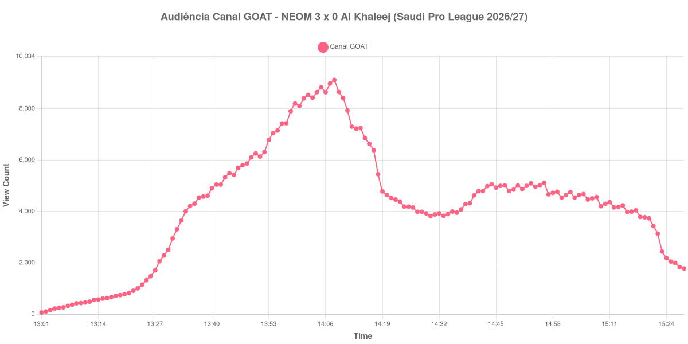

+++
date = 2026-09-03T21:18:00-03:00
draft = false
title = "Confira como foi a audiência de NEOM X Al Khaleej no Canal GOAT - 03-09-2026"
author = 'Instituto Cambacica de Audiência'
summary = "Veja a medição em que o pico chegou antes do intervalo e a audiência nunca mais voltou ao patamar do primeiro tempo"
tags = ['YouTube', 'Analytics', 'Audiência', 'Canal-GOAT', 'NEOM', 'Al Khaleej', 'Saudi Pro League']
categories = ['Audiência']
canais = ['Canal GOAT']
campeonatos = ['Saudi Pro League 2026']
data_evento = 2026-09-03
+++

Neste texto, vamos informar os resultados da audiência em tempo real obtidos pelo Canal GOAT, durante a transmissão de NEOM X Al Khaleej, jogo da 5ª rodada da Saudi Pro League de 2026/27, no King Khalid Sport City Stadium, em Tabuk, em 03/09/2026. O NEOM venceu por 3 a 0, com gols de Alexandre Lacazette, Muhannad Al-Saad e Amadou Koné, todos no primeiro tempo, e chegou a 9 pontos na competição. O público presente não foi divulgado por nenhuma das fontes que consultamos.

A audiência começou a ser medida às 03/09/2026 13:01:55 (Horário de Brasília). Como a coleta começou menos de duas horas antes do apito inicial, o gráfico e os números abaixo partem do primeiro registro disponível; a transmissão também encerrou antes de completar duas horas após o apito final, de modo que o recorte vai até o último dado coletado. Os principais pontos da audiência são (em aparelhos conectados):

* **Início da Medição (13:01:55): 69**
* **Início da partida (13:30:55): 2.509**
* Após o gol de Alexandre Lacazette, do NEOM, aos 37 minutos do primeiro tempo (14:07:55): 8.983
* Após o gol de Muhannad Al-Saad, do NEOM, aos 39 minutos do primeiro tempo (14:09:55): 8.656
* Após o gol de Amadou Koné, do NEOM, aos 45 minutos do primeiro tempo (14:15:55): 6.857
* **Fim do primeiro tempo (14:17:55): 6.385**
* Durante o intervalo (14:30:55): 3.822
* **Início do segundo tempo (14:32:55): 3.926**
* **Final da partida (15:22:55): 3.134**
* **Final da Medição (15:28:55): 1.779**

O pico de audiência foi às 14:08:55, ainda no primeiro tempo, com **9.121** aparelhos conectados simultâneos.

Esta curva conta uma história incomum e vale a pena olhar para a ordem dos marcos: o pico chegou um minuto depois do primeiro gol e a audiência já estava caindo quando o terceiro saiu. Os três gols do NEOM aparecem na lista com valores decrescentes — 8.983, depois 8.656, depois 6.857 —, e o apito que fechou o primeiro tempo pegou a transmissão com 6.385 aparelhos. Um 3 a 0 construído em oito minutos resolveu a partida cedo demais, e o público simplesmente não teve motivo para ficar.

O que veio depois confirma isso. O intervalo levou 40% da audiência, dos 6.385 do fim do primeiro tempo para os 3.822 do registro do intervalo, e o segundo tempo inteiro nunca superou 5.115 aparelhos, o melhor minuto da etapa, às 14:56:55 — abaixo, portanto, dos 6.385 com que o primeiro tempo havia terminado. Do recomeço ao apito final a curva perdeu força de novo: os 3.134 do encerramento da partida estão abaixo dos 3.926 do recomeço, e os 1.779 do último registro são 43% abaixo dos 3.134 do apito final.

Com 9.121 aparelhos, esta é a menor das onze medições deste lote. Entre as 19 que temos da Saudi Pro League, é a 12ª, e entre as 33 do Canal GOAT, a 19ª — bem distante de [Al Nassr X Al Taawoun](/posts/2026-08-28-al-nassr-x-al-taawoun-canal-goat/), a maior do canal e da competição, com 139.251 aparelhos conectados no pico.

No gráfico a seguir, mostramos a evolução da audiência entre o primeiro registro da medição e o último registro coletado, num total de 148 registros:

Para você verificar os metadados desta medição, você pode consultar os [prints do minuto a minuto da transmissão](https://github.com/institutocambacica/audiencias_31_08_03_09_2026/tree/main/2026-09-03_06-53-52/video_Q42CPN-NW2U) e o [CSV com os dados da sessão](https://github.com/institutocambacica/audiencias_31_08_03_09_2026/blob/main/2026-09-03_06-53-52/results.csv), na coluna `https://www.youtube.com/watch?v=Q42CPN-NW2U`.

---

*Para mais informações sobre nossa metodologia, visite nossa página [Sobre](/sobre).*
