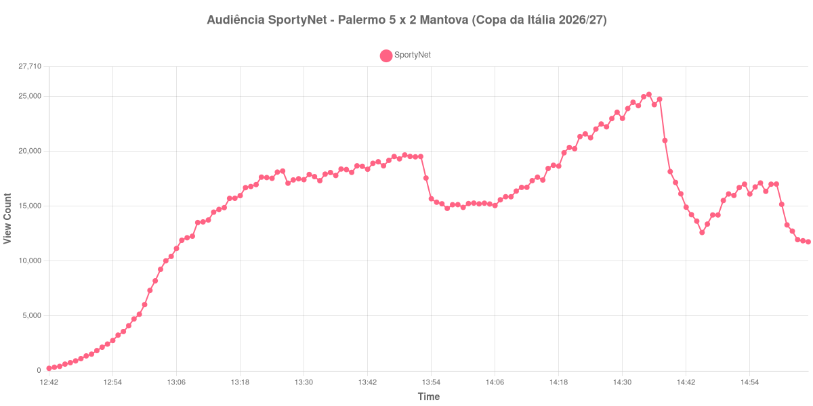

+++
date = 2026-09-03T21:15:00-03:00
draft = false
title = "Confira como foi a audiência de Palermo X Mantova na SportyNet - 03-09-2026"
author = 'Instituto Cambacica de Audiência'
summary = "Veja a maior audiência que já medimos na Copa da Itália, num 5 a 2 com sete gols e um esvaziamento no meio do segundo tempo"
tags = ['YouTube', 'Analytics', 'Audiência', 'SportyNet', 'Palermo', 'Mantova', 'Copa da Italia']
categories = ['Audiência']
canais = ['SportyNet']
campeonatos = ['Copa da Italia 2026']
data_evento = 2026-09-03
+++

Neste texto, vamos informar os resultados da audiência em tempo real obtidos na SportyNet, durante a transmissão de Palermo X Mantova, jogo único da segunda rodada da Copa da Itália de 2026/27, no Stadio Renzo Barbera, em Palermo, em 03/09/2026. O Palermo venceu por 5 a 2 e avançou às oitavas de final, com dois gols de Joel Pohjanpalo e um de Gabriel Strefezza, Antonio Palumbo e Dennis Johnsen; Francesco Ruocco e Rareș Kouda descontaram para o Mantova, que havia eliminado a Lazio na rodada anterior. O público presente não foi divulgado por nenhuma das fontes que consultamos.

A audiência começou a ser medida às 03/09/2026 12:42:55 (Horário de Brasília). Como a coleta começou menos de duas horas antes do apito inicial, o gráfico e os números abaixo partem do primeiro registro disponível; na outra ponta, a medição foi encerrada com a transmissão ainda no ar, doze minutos depois do apito final, e por isso o recorte vai até o último dado coletado. Os principais pontos da audiência são (em aparelhos conectados):

* **Início da Medição (12:42:55): 228**
* **Início da partida (13:00:55): 6.034**
* Após o gol de Gabriel Strefezza, do Palermo, aos 9 minutos do primeiro tempo (13:09:55): 12.268
* Após o gol de Antonio Palumbo, do Palermo, aos 45+6 minutos do primeiro tempo (13:51:55): 19.498
* **Fim do primeiro tempo (13:52:55): 19.527**
* Durante o intervalo (13:57:55): 14.802
* **Início do segundo tempo (14:07:55): 15.584**
* Após o gol de Francesco Ruocco, do Mantova, aos 52 minutos do segundo tempo (14:09:55): 15.860
* Após o gol de Rareș Kouda, do Mantova, aos 55 minutos do segundo tempo (14:12:55): 16.722
* Após o gol de Joel Pohjanpalo, do Palermo, aos 70 minutos do segundo tempo (14:27:55): 22.234
* Após o gol de Dennis Johnsen, do Palermo, aos 89 minutos do segundo tempo (14:46:55): 13.372
* Após o gol de Joel Pohjanpalo, do Palermo, aos 90+5 minutos do segundo tempo (14:52:55): 16.698
* **Final da partida (14:53:55): 17.007**
* **Final da Medição (15:05:55): 11.754**

O pico de audiência foi às 14:35:55, já no segundo tempo, com **25.190** aparelhos conectados simultâneos.

Nenhuma transmissão da Copa da Itália que já medimos chegou tão alto: esta é a 1ª entre as nove medições que temos da competição, à frente de [Pisa X Empoli](/posts/2026-08-17-pisa-x-empoli-sportynet/), cujo máximo foi de 19.954 aparelhos conectados. Entre as 44 medições da SportyNet, é a 23ª. A curva subiu bem: os 25.190 do pico ficaram 317% acima dos 6.034 registrados no apito inicial, e o segundo tempo foi claramente maior que o primeiro — dos 15.584 do recomeço até o pico, uma alta de 62%.

O primeiro tempo esticado é um dado em si. O intervalo só apareceu na curva aos 52 minutos de jogo, e a explicação está na súmula: o segundo gol do Palermo foi um pênalti convertido aos 45+6, o que sozinho empurra o apito para além dos 51 minutos. Foi o primeiro tempo mais longo das onze medições deste lote, cuja mediana ficou em 48 minutos. A pausa em si foi curta na curva: 24% de queda, dos 19.527 do fim do primeiro tempo para os 14.802 do registro do intervalo — e o fundo do vale chegou cedo, cinco minutos depois do apito.

O movimento mais estranho da medição não é o intervalo, e sim o que acontece logo depois do pico. Às 14:37:55 a transmissão tinha 24.753 aparelhos conectados; oito minutos depois, às 14:45:55, tinha 12.605. É a maior perda de audiência de toda a medição — maior, em número de aparelhos, do que a do próprio intervalo, que foi dos 19.527 do apito para os 14.802 do registro da pausa —, e aconteceu com o Palermo vencendo por 3 a 2. O público voltou em parte: o gol de Johnsen aos 89 minutos aparece com 13.372 aparelhos, o de Pohjanpalo nos acréscimos com 16.698, e o máximo do pós-jogo, às 14:56:55, chegou a 17.118. Não temos como atribuir esse vaivém a uma causa única, e não vamos tentar: registramos o que a curva mostra. No encerramento, os 11.754 do último registro estão 31% abaixo dos 17.007 do apito final.

No gráfico a seguir, mostramos a evolução da audiência entre o primeiro registro da medição e o último registro coletado, num total de 144 registros:

Para você verificar os metadados desta medição, você pode consultar os [prints do minuto a minuto da transmissão](https://github.com/institutocambacica/audiencias_31_08_03_09_2026/tree/main/2026-09-03_06-53-52/video_U6cTDweTIRc) e o [CSV com os dados da sessão](https://github.com/institutocambacica/audiencias_31_08_03_09_2026/blob/main/2026-09-03_06-53-52/results.csv), na coluna `https://www.youtube.com/watch?v=U6cTDweTIRc`.

---

*Para mais informações sobre nossa metodologia, visite nossa página [Sobre](/sobre).*
