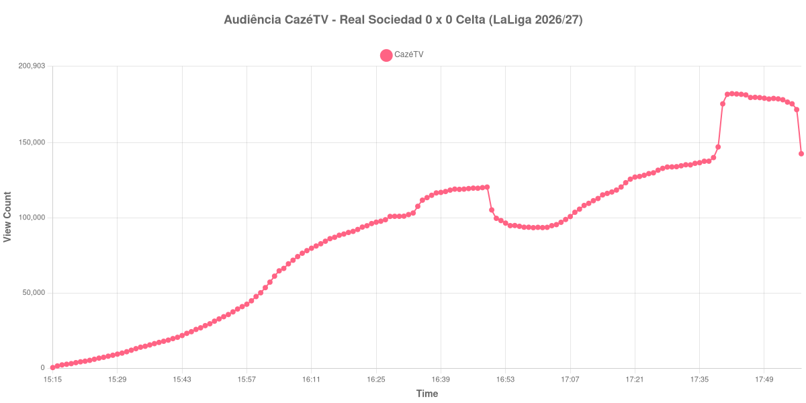

+++
date = 2026-09-03T21:27:00-03:00
draft = false
title = "Confira como foi a audiência de Real Sociedad X Celta na CazéTV - 03-09-2026"
author = 'Instituto Cambacica de Audiência'
summary = "Veja por que o máximo desta medição não pode ser lido como interesse pela partida: ele veio de uma troca de live"
tags = ['YouTube', 'Analytics', 'Audiência', 'CazeTV', 'Real Sociedad', 'Celta', 'LaLiga']
categories = ['Audiência']
canais = ['CazeTV']
campeonatos = ['LaLiga 2026']
data_evento = 2026-09-03
+++

Neste texto, vamos informar os resultados da audiência em tempo real obtidos na CazéTV, durante a transmissão de Real Sociedad X Celta, jogo antecipado da 6ª rodada da LaLiga de 2026/27, em Anoeta, em San Sebastián, em 03/09/2026, diante de 30.364 pessoas. A partida terminou em 0 a 0, num jogo em que a Real Sociedad dominou o primeiro tempo e o goleiro Ionut Radu segurou o empate para os visitantes. A rodada foi antecipada porque o calendário europeu obrigou os dois clubes a jogá-la antes do previsto.

A audiência começou a ser medida às 03/09/2026 15:15:55 (Horário de Brasília). Como a coleta começou menos de duas horas antes do apito inicial, o gráfico e os números abaixo partem do primeiro registro disponível; na outra ponta, o recorte termina às 17:57:55 porque a transmissão foi retitulada no ar e o mesmo vídeo passou a exibir outro programa do canal. Os principais pontos da audiência são (em aparelhos conectados):

* **Início da Medição (15:15:55): 337**
* **Início da partida (16:00:55): 50.122**
* **Fim do primeiro tempo (16:49:55): 120.469**
* Durante o intervalo (16:59:55): 93.448
* **Início do segundo tempo (17:04:55): 95.480**
* **Final da partida (17:52:55): 179.171**
* **Final da Medição (17:57:55): 142.659**

O pico de audiência foi às 17:42:55, já no segundo tempo, com **182.639** aparelhos conectados simultâneos.

Esse máximo precisa de uma ressalva, e ela é o dado mais importante deste post: ele não mede interesse pela partida, e sim migração de público. Às 17:38:55 a transmissão tinha 140.105 aparelhos conectados; às 17:41:55, 182.220. O salto é explicado por outra medição deste mesmo lote — [Toulouse X Lille](/posts/2026-09-03-toulouse-x-lille-cazetv/), também na CazéTV, registrou seu último dado às 17:38:55, com 50.353 aparelhos, e o público que saiu de lá dá conta do que entrou aqui. O pico veio três minutos depois desse degrau. O teto que a partida produziu por conta própria são os 140.105 do minuto anterior à troca, e é esse o número a usar em qualquer comparação honesta. Pela mesma razão, não calculamos aqui a variação do segundo tempo nem a relação entre o pico e o apito inicial: os dois derivados seriam falseados pelo degrau.

Fora isso, a curva é regular. O primeiro tempo subiu sem sobressaltos, dos 50.122 do apito inicial aos 120.469 do intervalo, e a pausa levou 22% do público, para os 93.448 do registro do intervalo — a segunda menor queda de intervalo do lote, cuja mediana foi de 32%. O segundo tempo retomou a subida a partir dos 95.480 do recomeço e seguiu crescendo até o degrau. Depois do apito final, os 142.659 do último registro estão 20% abaixo dos 179.171 do encerramento da partida, mas o recorte fecha cedo demais para dizer qualquer coisa sobre retenção de pós-jogo.

Entre as 28 medições que temos da LaLiga, esta é a 12ª, e entre as 75 da CazéTV, a 30ª — posições que, pelo motivo explicado acima, o leitor deve ler com a mesma ressalva do pico.

No gráfico a seguir, mostramos a evolução da audiência entre o primeiro registro da medição e o último minuto em que o vídeo ainda exibia Real Sociedad X Celta, num total de 163 registros:

Para você verificar os metadados desta medição, você pode consultar os [prints do minuto a minuto da transmissão](https://github.com/institutocambacica/audiencias_31_08_03_09_2026/tree/main/2026-09-03_06-53-52/video_SmUoJxrZkYk) — atenção: os prints posteriores ao nosso último registro já pertencem a outro programa — e o [CSV com os dados da sessão](https://github.com/institutocambacica/audiencias_31_08_03_09_2026/blob/main/2026-09-03_06-53-52/results.csv), na coluna `https://www.youtube.com/watch?v=SmUoJxrZkYk`.

---

*Para mais informações sobre nossa metodologia, visite nossa página [Sobre](/sobre).*
