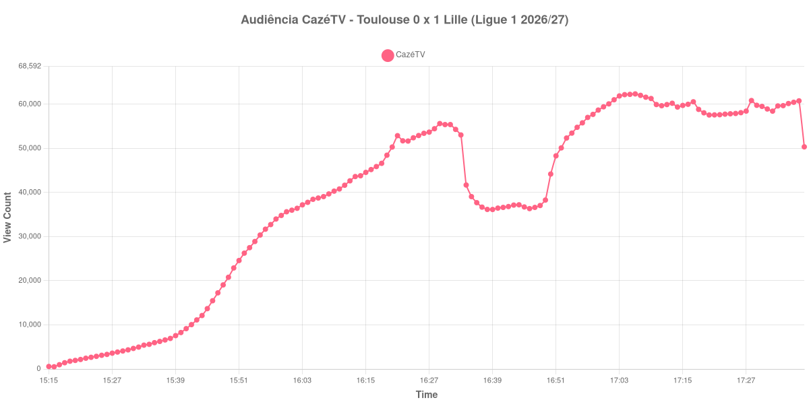

+++
date = 2026-09-03T21:24:00-03:00
draft = false
title = "Confira como foi a audiência de Toulouse X Lille na CazéTV - 03-09-2026"
author = 'Instituto Cambacica de Audiência'
summary = "Veja o intervalo mais nítido de todo o lote e uma medição que terminou junto com a partida"
tags = ['YouTube', 'Analytics', 'Audiência', 'CazeTV', 'Toulouse', 'Lille', 'Ligue 1']
categories = ['Audiência']
canais = ['CazeTV']
campeonatos = ['Ligue 1 2026']
data_evento = 2026-09-03
+++

Neste texto, vamos informar os resultados da audiência em tempo real obtidos na CazéTV, durante a transmissão de Toulouse X Lille, jogo da 3ª rodada da Ligue 1 de 2026/27, no Stadium de Toulouse, em 03/09/2026. O Lille venceu por 1 a 0, com gol de Ayase Ueda, que havia entrado durante a partida, e assumiu provisoriamente a liderança do campeonato. Foi uma vitória contra a corrente: o Toulouse finalizou 22 vezes, contra 8 do adversário. O público presente não foi divulgado por nenhuma das fontes que consultamos.

A audiência começou a ser medida às 03/09/2026 15:15:55 (Horário de Brasília). Como a coleta começou menos de duas horas antes do apito inicial, o gráfico e os números abaixo partem do primeiro registro disponível; na outra ponta, a medição se encerrou um minuto depois do apito final, de modo que o recorte vai até o último dado coletado. Os principais pontos da audiência são (em aparelhos conectados):

* **Início da Medição (15:15:55): 572**
* **Início da partida (15:45:55): 13.681**
* **Fim do primeiro tempo (16:33:55): 53.048**
* Durante o intervalo (16:39:55): 36.155
* **Início do segundo tempo (16:48:55): 37.053**
* Após o gol de Ayase Ueda, do Lille, aos 73 minutos do segundo tempo (17:15:55): 59.744
* **Final da partida (17:37:55): 60.780**
* **Final da Medição (17:38:55): 50.353**

O pico de audiência foi às 17:06:55, já no segundo tempo, com **62.356** aparelhos conectados simultâneos.

Poucas curvas dizem com tanta clareza onde o primeiro tempo acabou. Entre um minuto e o seguinte, às 16:33:55, o contador caiu de 53.048 para 41.704 aparelhos — uma queda de 21% em sessenta segundos, sem ambiguidade nenhuma sobre onde o primeiro tempo terminou. A pausa completa custou 32% do público, dos 53.048 do fim do primeiro tempo para os 36.155 do registro do intervalo, exatamente a mediana do lote.

O segundo tempo foi maior que o primeiro em todos os sentidos. Dos 37.053 do recomeço até os 62.356 do pico, a audiência cresceu 68%, superando com folga os 55.630 do melhor minuto do primeiro tempo, e o patamar se manteve até o fim: o gol de Ueda aparece com 59.744 aparelhos e o apito final pegou a transmissão em 60.780. Os 62.356 do pico ficaram 356% acima dos 13.681 registrados no apito inicial.

O encerramento merece nota. A coleta parou um minuto depois do apito final, e por isso a retenção pós-jogo mal chega a ser medida: os 50.353 do último registro estão apenas 17% abaixo dos 60.780 do encerramento da partida, e essa distância curta diz mais sobre o fim da coleta do que sobre o comportamento do público. Esse fim tem uma consequência do outro lado do canal: três minutos depois, a nossa medição de [Real Sociedad X Celta](/posts/2026-09-03-real-sociedad-x-celta-cazetv/), também na CazéTV, saltou para 182.220 aparelhos. Entre as 19 medições que temos da Ligue 1, esta é a 4ª, atrás de [Lille X PSG](/posts/2026-08-28-lille-x-psg-cazetv/), que chegou a 448.507; entre as 75 da CazéTV, é a 43ª.

No gráfico a seguir, mostramos a evolução da audiência entre o primeiro registro da medição e o último registro coletado, num total de 144 registros:

Para você verificar os metadados desta medição, você pode consultar os [prints do minuto a minuto da transmissão](https://github.com/institutocambacica/audiencias_31_08_03_09_2026/tree/main/2026-09-03_06-53-52/video_44En7SSpO2Y) e o [CSV com os dados da sessão](https://github.com/institutocambacica/audiencias_31_08_03_09_2026/blob/main/2026-09-03_06-53-52/results.csv), na coluna `https://www.youtube.com/watch?v=44En7SSpO2Y`.

---

*Para mais informações sobre nossa metodologia, visite nossa página [Sobre](/sobre).*
